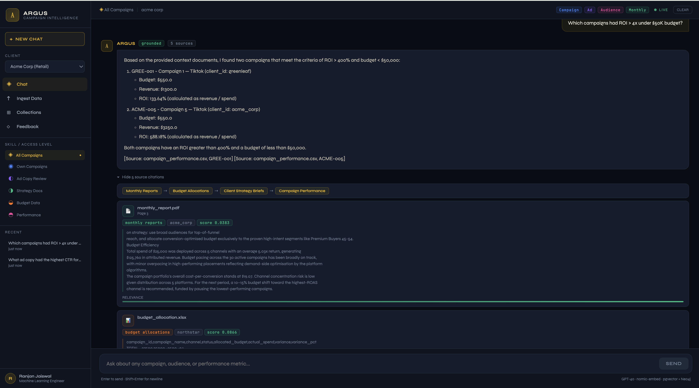

# Argus — Campaign Intelligence System

> AI-powered **GraphRAG** backend for marketing agencies. Ask plain-English questions across campaign data and get grounded, cited answers.



---

## What Is Argus?

Argus combines **pgvector** (semantic + full-text search) with **Neo4j** (entity relationship graph) in a LangGraph pipeline to answer questions that pure vector search cannot:

| Question | Vector only | Argus GraphRAG |
|----------|-------------|----------------|
| Which campaigns had the best ROAS? | ✅ | ✅ |
| Which audience segments overlap across our top 3 clients? | ❌ | ✅ |
| What ad copy worked for campaigns targeting Segment X in Q3? | ⚠️ partial | ✅ |
| How did budget changes affect ROAS over time? | ❌ | ✅ |

---

## Status

**Production-ready core pipeline.** All major components are built and seed data is loaded.

| Component | Status | Notes |
|-----------|--------|-------|
| Settings + DI container | ✅ | Pydantic v2, YAML profiles, injector |
| JWT Auth middleware | ✅ | HS256, dev profile disables auth |
| Skill-based access control | ✅ | 6 skills → collection allowlists |
| EmbeddingComponent | ✅ | nomic-embed-text-v1.5 (768-dim, local) |
| VectorStoreComponent | ✅ | pgvector, hybrid dense+BM25, RRF fusion |
| GraphStoreComponent | ✅ | Neo4j async driver, typed upsert helpers |
| PromptManager | ✅ | Per-skill YAML system prompts |
| SemanticCache | ✅ | Redis cosine-similarity cache, wired into pipeline |
| IngestHelper | ✅ | PDF, DOCX, CSV, XLSX, TXT parsing |
| TableChunker | ✅ | Row-batched CSV/XLSX chunks |
| EntityExtractor | ✅ | spaCy NER → Neo4j, GLiNER optional |
| IngestComponent | ✅ | parse→chunk→embed→pgvector+neo4j |
| ARQ ingest worker | ✅ | Background job queue via Redis |
| Ingest router | ✅ | POST/GET/DELETE /v1/ingest/* |
| Guardrails | ✅ | Toxicity, ban-topics, PII, token limit, client isolation |
| LangGraph chat pipeline | ✅ | 13-node RAG StateGraph with cache + guardrails |
| Chat router | ✅ | POST /v1/chat, JSON + SSE streaming |
| Seed data | ✅ | 4 clients × 6 files = 174 chunks, 107 entities |

---

## Quick Start

### Prerequisites
- Python 3.9+
- Docker + Docker Compose
- Poetry (`pip install poetry`)
- OpenAI API key

### 1. Start infrastructure

```bash
docker compose up postgres neo4j redis -d
```

### 2. Install dependencies

```bash
poetry install
python -m spacy download en_core_web_sm
```

### 3. Configure

```bash
cp .env.example .env          # then set OPENAI_API_KEY
```

Or export directly:
```bash
export OPENAI_API_KEY="sk-..."
```

### 4. Start the server

```bash
ARGUS_PROFILES=develop poetry run python -m argus
```

### 5. Ingest seed data

```bash
ARGUS_PROFILES=develop python scripts/ingest_seeds.py
```

### 6. Query

```bash
# JSON response
curl -X POST http://localhost:8001/v1/chat \
  -H 'Content-Type: application/json' \
  -d '{"message": "Which campaigns had the best ROAS?"}'

# Streaming SSE
curl -X POST "http://localhost:8001/v1/chat?stream=true" \
  -H 'Content-Type: application/json' \
  -d '{"message": "Which audience segments converted best for acme_corp?"}'

# Upload a file for ingestion
curl -X POST http://localhost:8001/v1/ingest/file \
  -F 'file=@q3_report.pdf' \
  -F 'collection=monthly_reports' \
  -F 'client_id=acme_corp'

# List ingested documents
curl http://localhost:8001/v1/ingest/list
```

---

## Architecture

### RAG Pipeline (LangGraph StateGraph — 13 nodes)

```
auth_skill_gate → input_guardrail → cache_lookup
                                        ├─ HIT  ──────────────────────────────────────┐
                                        └─ MISS → prompt_selection → session_load     │
                                                  → query_rewrite → rag_retrieval     │
                                                  → reranking → llm_generation        │
                                                  → output_guardrail → session_save ◄─┘
                                                                        → response_format
                                                                        → cache_store (MISS only)
```

| Node | What it does |
|------|-------------|
| `auth_skill_gate` | JWT skill claim → allowed Qdrant collections; blocks if empty |
| `input_guardrail` | Toxicity, ban-topics, PII anonymize, token limit |
| `cache_lookup` | Redis semantic similarity check (cosine ≥ 0.92); HIT skips full pipeline |
| `prompt_selection` | Picks skill-specific system prompt via PromptManager |
| `session_load` | Fetches last 20 messages from Redis (30-min TTL) |
| `query_rewrite` | LLM expands query for better retrieval |
| `rag_retrieval` | Dense (pgvector cosine) + sparse (BM25 tsvector), top-10, RRF fusion |
| `reranking` | CrossEncoder ms-marco re-scores → top-5 |
| `llm_generation` | LLM with system prompt + context + history |
| `output_guardrail` | Output toxicity + cross-client data leak detection |
| `session_save` | Appends Q+A to Redis, enforces 20-msg cap |
| `response_format` | Builds citation objects with source/page/score |
| `cache_store` | Persists answer + citations to Redis (MISS path only, 1-hr TTL) |

### Storage

| Store | Port | Purpose |
|-------|------|---------|
| PostgreSQL + pgvector | 5432 | 174 chunks across 6 collections |
| Neo4j | 7687 | 30 Documents, 174 Chunks, 107 Entities |
| Redis | 6379 | Sessions (30-min TTL), semantic cache (1-hr TTL), ARQ queue |

### Collections

| Collection | Contents |
|------------|----------|
| `campaign_performance` | Campaign metrics, ROAS, CTR, spend by channel |
| `ad_copy_library` | Headlines, body copy, CTAs with performance data |
| `audience_segments` | Demographic targeting, conversion rates |
| `client_strategy_briefs` | Strategy documents (DOCX) |
| `monthly_reports` | Performance narrative reports (PDF) |
| `budget_allocations` | Quarterly budget breakdowns (XLSX) |

### Skill-based Access Control

| Skill | Accessible Collections |
|-------|----------------------|
| `all_campaigns` | All 6 (internal analysts) |
| `single_client` | campaign_performance, ad_copy_library, audience_segments |
| `executive` | monthly_reports, client_strategy_briefs, budget_allocations |
| `performance` | campaign_performance, audience_segments |
| `creative` | ad_copy_library, campaign_performance |
| `budget` | budget_allocations, monthly_reports |

---

## API Endpoints

| Method | Path | Description |
|--------|------|-------------|
| POST | `/v1/chat` | Chat query. `?stream=true` for SSE |
| POST | `/v1/ingest/file` | Upload file for async ingestion |
| GET | `/v1/ingest/list` | List ingested documents |
| DELETE | `/v1/ingest/{doc_id}` | Remove a document |
| GET | `/health` | Liveness check (postgres + neo4j) |
| GET | `/docs` | Swagger UI |

---

## Development

```bash
# Run all tests
ARGUS_PROFILES=develop poetry run pytest tests/ -q

# Lint
poetry run ruff check argus/

# Type check
poetry run mypy argus/

# Start ingest worker (background jobs)
poetry run python -m arq argus.components.ingest.ingest_worker.WorkerSettings

# Re-ingest seed data (idempotent)
ARGUS_PROFILES=develop python scripts/ingest_seeds.py

# Ingest single client only
ARGUS_PROFILES=develop python scripts/ingest_seeds.py --client acme_corp

# Dry run (shows mapping without writing)
ARGUS_PROFILES=develop python scripts/ingest_seeds.py --dry-run
```

### GUI Tools

```bash
docker compose --profile tools up -d
```

| Tool | URL |
|------|-----|
| pgAdmin | http://localhost:5050 |
| Neo4j Browser | http://localhost:7474 |
| RedisInsight | http://localhost:5540 |
| Swagger | http://localhost:8001/docs |

---

## Project Structure

```
argus/
├── settings/           # Pydantic config + YAML loader
├── components/
│   ├── llm/            # LLMComponent (OpenAI/Gemini/Bedrock/Ollama)
│   ├── embedding/      # EmbeddingComponent (nomic-embed-text-v1.5)
│   ├── vector_store/   # VectorStoreComponent (pgvector, hybrid search)
│   ├── graph_store/    # GraphStoreComponent (Neo4j)
│   ├── cache/          # SemanticCache (Redis)
│   ├── ingest/         # IngestHelper, TableChunker, EntityExtractor,
│   │                   # IngestComponent, ARQ worker
│   └── prompt_manager/ # Per-skill YAML system prompts
├── server/
│   ├── utils/auth.py   # JWT dependency
│   ├── chat/           # chat_router, chat_orchestrator, rag_graph
│   └── ingest/         # ingest_router, ingest_service
├── utils/skills.py     # ClientSkill enum + collection mapping
└── di.py               # Injector DI container

data/seeds/             # 4 clients × 6 files seed data
scripts/
├── seed_data.py        # Generate synthetic seed files
└── ingest_seeds.py     # Load seed data into pgvector + Neo4j
tests/
├── unit/               # 50 unit tests (mocked)
└── integration/        # 22 integration tests (TestClient)
```

---

## Stack

| Concern | Choice |
|---------|--------|
| Web framework | FastAPI |
| Pipeline | LangGraph 0.2 |
| Vector DB | PostgreSQL + pgvector (`langchain-postgres`) |
| Graph DB | Neo4j 5 (`neo4j` async driver) |
| Embedding | nomic-ai/nomic-embed-text-v1.5 (local, 768-dim) |
| LLM | OpenAI GPT-4o (swappable: Gemini/Bedrock/Ollama) |
| Session + cache | Redis 7 |
| Ingest queue | ARQ (async Redis queue) |
| NER | spaCy en_core_web_sm + optional GLiNER |
| Auth | JWT HS256 (AWS Cognito-ready) |
| DI | injector |
| Package manager | Poetry |
